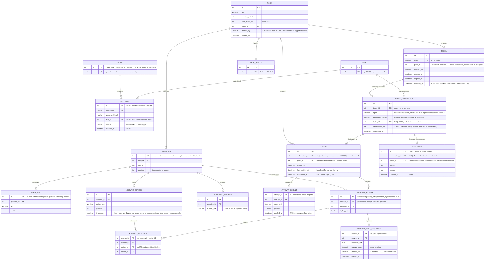

# ERD — Database Plan (v2)

> Changes from v1 marked **+** (added) / **−** (dropped) / **~** (modified).
> Complementary API shapes live in [Contract.md](Contract.md).

## Deltas from v1

| # | Change | Rationale |
|---|---|---|
| 1 | **+ `TOKEN_REDEMPTION.attendance_no`** | batch set selector (odd/even → setA/setB) had no home anywhere |
| 2 | **~ Redemption fields required** — `npm`, `participant_name`, `kelas_id` no longer considered nullable | contract's `redeem` validates all required |
| 3 | **− `TOKEN.role_id`, ROLE-from-TOKEN usage** — ROLE table kept but referenced only by ACCOUNT | tokens are exam-only; authorization is account-based |
| 4 | **~ `TOKEN.pack_id` NOT NULL** (was optional staff-token escape hatch) | one token = one exam pack; admin access is no longer token-based |
| 5 | **~ `PACK.created_by` / `ATTEMPT_TEXT_RESPONSE.graded_by` = ACCOUNT username** — "audit-lite (no accounts to FK to)" is superseded since ACCOUNT now exists | audit values come from the admin session |
| 6 | **+ `ACCOUNT`** { username UK, password_hash, role_id FK, status } | usernames/password admin credentials per decision of record #4 |
| 7 | **+ `IMAGE_URL`** 1:N from QUESTION (with position) | kasus stimulus images previously rendered from mock data with no storage |
| 8 | **~ `ATTEMPT`: 1 per redemption** (relationship starts o\|) | single-attempt retake policy, enforced at `exam.start()` |
| 9 | **+ `FEEDBACK`** { kesan, pesan, kelas_id } linked to redemption_id UNIQUE | kesan-pesan was end-to-end in mockup with zero backing; identity scrubbed in admin listing |
| 10 | **~ `ANSWER_OPTION.is_correct`** — stays in DB, guaranteed stripped from any serialized client payload | explicit after `options` became `{text, isCorrect}` inputs |
| 11 | **+ `ACCOUNT` relationship to ROLE** | role management (`admin.user.*`) needs it |

## Intentionally left out

- **No `FEEDBACK ↔ ATTEMPT_ANSWER` linkage** — feedback is per-redemption, not per-attempt.
- **No soft-delete on QUESTION/PACK** — publish is one-way; drafts are the only deletable state.
- **No progress/status counters** — monitoring derives status from `last_activity_at` staleness + `submitted_at`.
- **No `kesan-pesan` admin approval flow** — listing is read-only (+ CSV export).
